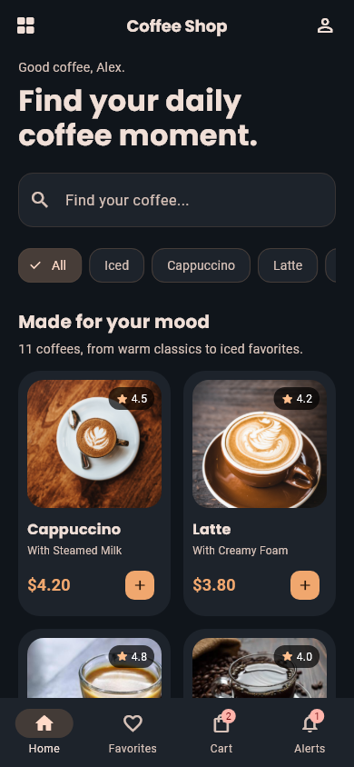
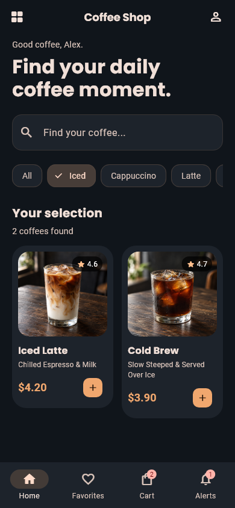
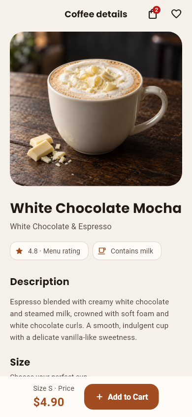
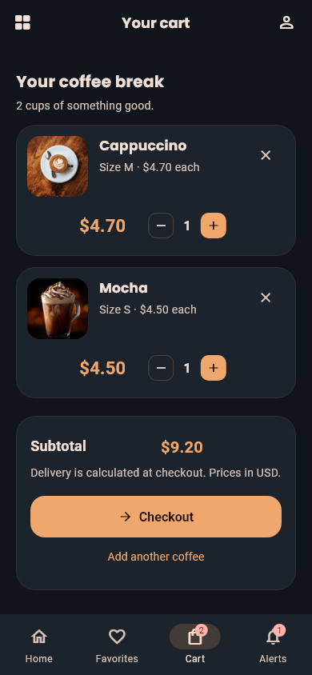
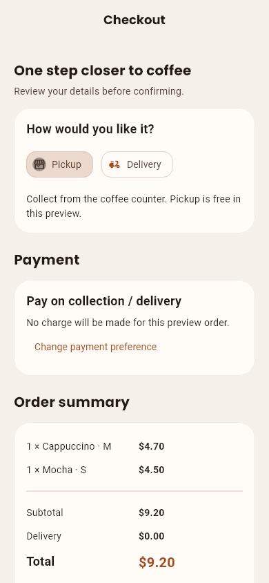
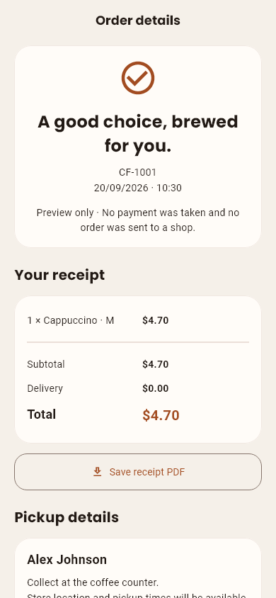

<div align="center">

# Coffee Shop · Flutter

**A complete coffee-ordering UI, from the first browse to the final receipt.**

Flutter · Dart · GetX · Android & iOS project structure

[Screenshots](#screenshots) · [Features](#features) · [Get started](#get-started) · [Roadmap](docs/ROADMAP.md)

</div>

Coffee Shop is a Flutter portfolio project with an 11-drink menu, warm café styling, dark and light themes, and connected shopping flows. Browse coffees, customize a cup, manage a cart, place a demo order, and export its receipt as a PDF.

> **Project status:** The UI and demo shopping flows are implemented. The current app uses in-memory demo accounts and orders. Supabase/PostgreSQL integration is the next phase; it is **not connected in this version**. No real payment is collected or order sent to a shop.

## Screenshots

Actual app screens captured by Flutter widget previews.

<table>
  <tr>
    <th>Discover your coffee</th>
    <th>Iced favorites</th>
    <th>Product details · light</th>
  </tr>
  <tr>
    <td></td>
    <td></td>
    <td></td>
  </tr>
  <tr>
    <th>Your cart</th>
    <th>Checkout</th>
    <th>Order receipt</th>
  </tr>
  <tr>
    <td></td>
    <td></td>
    <td></td>
  </tr>
</table>

## Features

| Area | Included |
| --- | --- |
| Menu | 11 coffees, individual photography and descriptions, combined search and category filters, iced and milk labels |
| Product details | Small/medium/large sizing, updated prices, favorites and add to cart |
| Cart | Quantity controls, removal with undo, totals and empty states |
| Checkout | Pickup/delivery selection, address validation, payment preference and order notes |
| Orders | Demo order history, itemized receipts, cancellation and reorder |
| PDF export | Styled receipts, multi-page item tables and Android's native Save PDF picker |
| Account | Demo sign-in/registration, editable profile, address and password flows |
| Navigation | Shared drawer, home/favorites/cart/alerts tabs and contextual cart actions |
| Appearance | Dark/light themes, responsive layouts, larger-text support and smooth transitions |
| Motion | Compact animated controls, reduced-motion support and an Android refresh-rate preference up to 120 Hz on supported devices |

The menu includes Cappuccino, Latte, Espresso, Americano, Mocha, Flat White, Caramel Latte, Iced Latte, Cold Brew, White Chocolate Mocha and Cortado. Menu ratings and prices are demo data.

## Get started

### Requirements

- Flutter with Dart **3.13.1 or newer, below 4.0.0**, as required by `pubspec.yaml`.
- An Android device/emulator and Android SDK, or macOS with Xcode for iOS development.
- The latest recorded development build used **Flutter 3.47.4 / Dart 3.13.3**.

```sh
git clone https://github.com/Ahsan-Qamar-Dev/Coffee-Shop-Using-Flutter.git
cd Coffee-Shop-Using-Flutter
flutter pub get
flutter run
```

No backend keys are required for the current demo. On Windows, enable Developer Mode if Flutter reports that desktop plugin symlinks are unavailable.

### Try the demo

Choose **Try demo account** on the login screen, or use:

| Field | Demo value |
| --- | --- |
| Email | `demo@coffee.test` |
| Password | `Coffee123!` |

These are public demo credentials. Use test details for registration: accounts, cart, favorites and order history are session-only and reset when the app restarts. Password recovery is a preview and does not send email.

**Suggested walkthrough:** browse the Iced category → open a drink → select a size → add it to the cart → complete demo checkout → save the receipt PDF → view the order from Alerts.

## Architecture

The app groups code by feature. GetX controllers hold UI state; repository interfaces separate authentication and ordering from their current demo implementations.

```text
lib/
├── app/                 # App bindings, shared navigation and drawer
├── core/                # Theme, motion, feedback and reusable widgets
└── features/
    ├── auth/            # Demo authentication and account flows
    ├── catalog/         # Coffee data, filtering and product screens
    ├── cart/            # Cart state and quantity controls
    ├── checkout/        # Address, payment preference and confirmation
    ├── favorites/       # Saved coffees for the current session
    ├── notifications/   # In-app order notifications
    ├── orders/          # Orders, PDF generation and export
    └── profile/         # Account details, settings and help
```

**Stack:** Flutter and Dart for UI, GetX for state management, `pdf` for receipt generation, `printing` for supported export flows, and Kotlin for Android document saving and refresh-rate preferences. Fonts and coffee images are bundled for offline display.

## Quality checks

The latest recorded UI checkpoint passed **114 automated tests** and **20 light/dark preview captures**, with a clean analyzer and successful Android profile build. Android receipt saving was also checked on a physical phone. These are recorded checks, not a live CI badge.

```sh
flutter analyze
flutter test
flutter build apk --profile
```

Tests cover navigation, authentication previews, catalog filtering, pricing, checkout, orders, profile changes, motion and receipt export. Responsive checks include narrow phones, landscape layouts, tablets and larger text.

To intentionally regenerate the visual previews after a UI change:

```sh
flutter test --dart-define=CAPTURE_UI=true --update-goldens test/ui_preview_test.dart
```

Platform folders are present for Android, iOS, web and desktop. **Android is the device-tested target; iOS, web and desktop still need platform-specific validation.** A 120 Hz preference does not guarantee every frame renders at 120 FPS.

## What's next

- [ ] Supabase authentication and persistent customer data
- [ ] PostgreSQL catalog and server-validated order pricing
- [ ] Persistent carts, favorites and order history
- [ ] Staff order management and live status updates
- [ ] iOS and wider platform validation
- [ ] Production payment integration and release preparation

See the [roadmap](docs/ROADMAP.md) for current boundaries and the [documentation index](docs/README.md) for implementation notes.

## Contributing

Bug reports and focused improvements are welcome. Read [CONTRIBUTING.md](CONTRIBUTING.md) for setup, checks and what to include in a pull request. Use the repository's issue templates to report a reproducible bug or suggest a feature.

## Author

Built by **[Ahsan Qamar](https://github.com/Ahsan-Qamar-Dev)** as a Flutter mobile development portfolio project.

Coffee image provenance is documented in [MENU_CATALOG.md](docs/MENU_CATALOG.md). Bundled fonts retain their license files in `assets/fonts/`.
